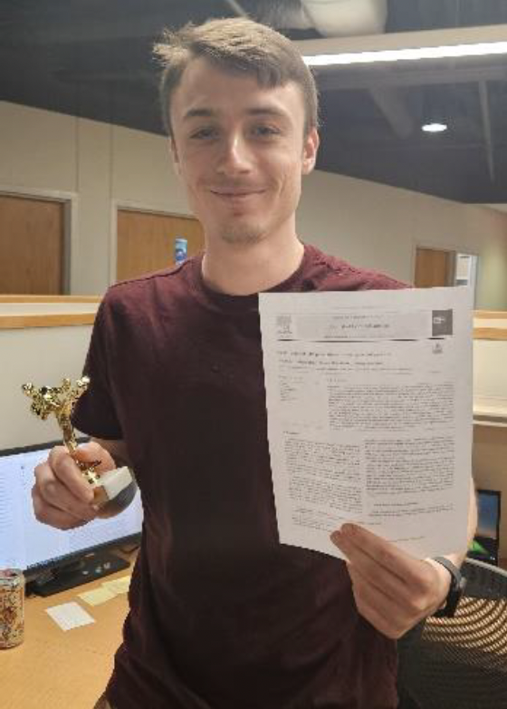

Congratulations to Ph.D. Candidate, [John Ursino](https://arcorrectionslab.org/author/john-ursino/), on his first lead-authored publication in Journal of Criminal Justice.

The article is titled ["Short timers and idle populations in overcrowded prisons."](https://arcorrectionslab.org/publication/ursino_et_al_2025/)

