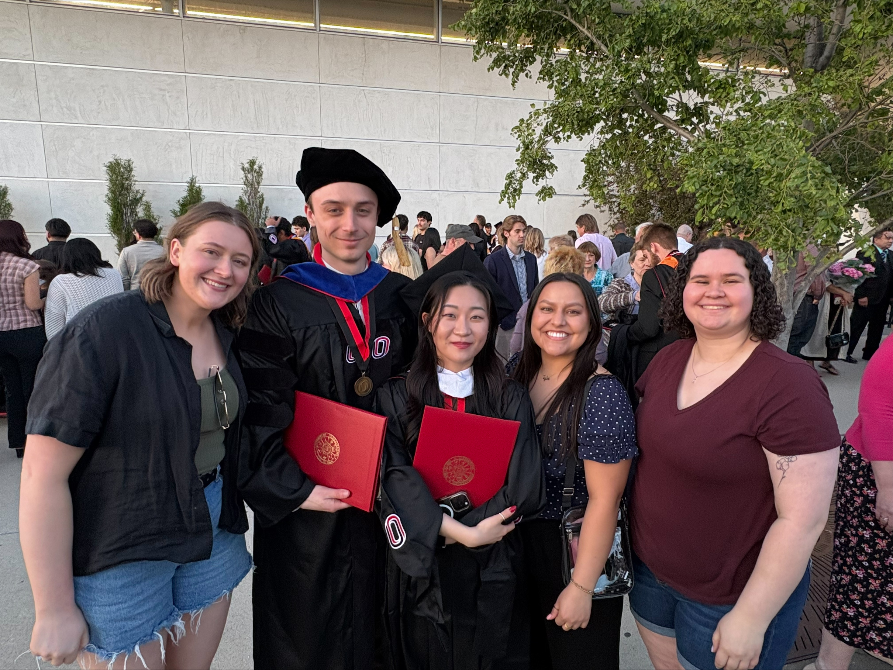
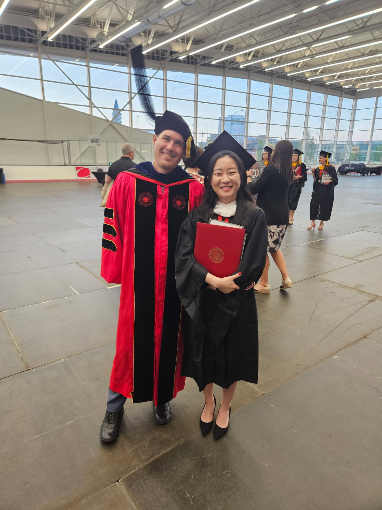
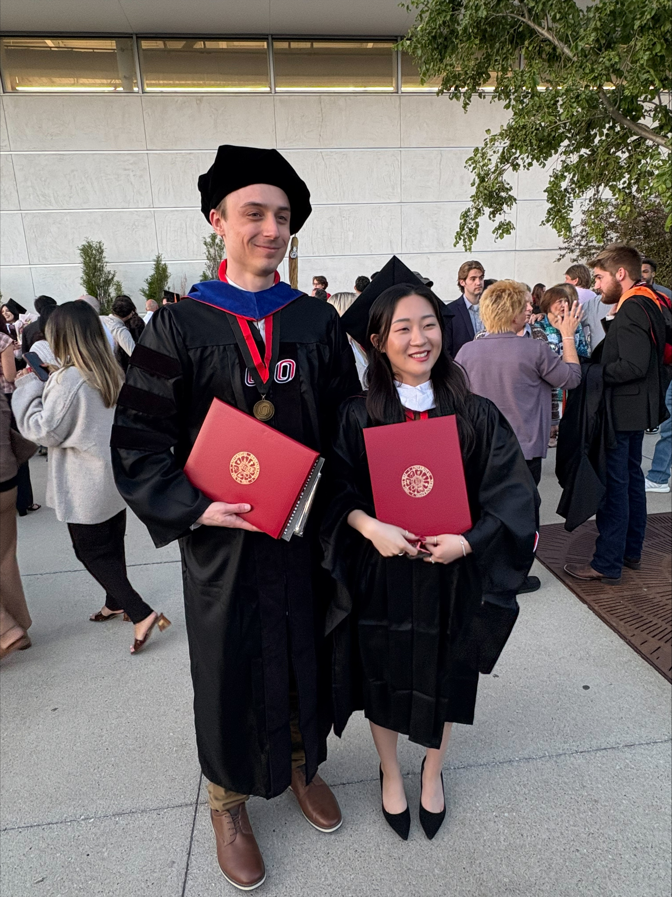

<!--more-->

On May 7th, three ARC Lab students walked across the stage:

[**Dr. Addison Kobie**](https://arcorrectionslab.org/author/addison-kobie/), [**Dr. John Ursino**](https://arcorrectionslab.org/author/john-ursino/), and [**Yujin Kim, MA**](https://arcorrectionslab.org/author/yujin-kim/).

ARC Lab students were also there to support and celebrate the moment together.

Following graduation, Dr. Ursino has accepted a Research Specialist position with the ARC Lab, and Yujin Kim will begin the PhD Program at George Mason University in Fall 2026.

A simple milestone, but an important one—congratulations to all.

