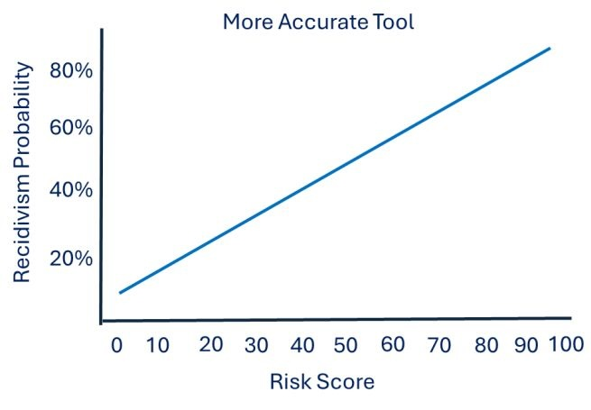
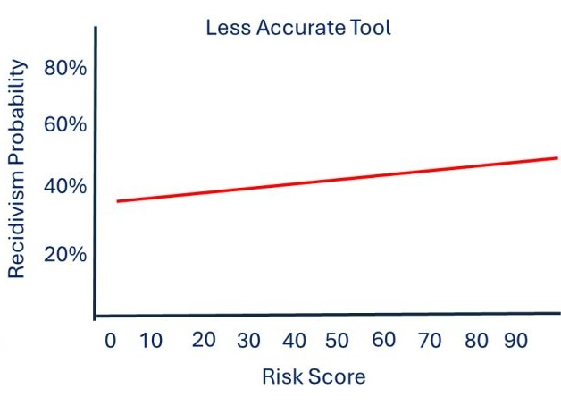

  
Module 0 · Start Here

  <h2>Risk scores shape real decisions.</h2>
  

    In corrections, classification, and pretrial settings, risk scores influence decisions
    about incarceration, supervision, and programming. But one basic issue is often
    overlooked: <strong>not all risk scores mean the same thing.</strong>
  

  <h2>Where Risk Scores Show Up</h2>
  
Risk-needs assessment tools are used every day in:

  <ul>
    <li>adult and juvenile corrections</li>
    <li>prison classification</li>
    <li>pretrial release decisions</li>
  </ul>
  
They shape decisions about incarceration, supervision, and programming.

  <h2>The Basic Problem</h2>
  
Two tools can both assign a “risk score” and still behave very differently.

  
That matters because a score is only useful if it meaningfully distinguishes between outcomes.

  

    <strong>The key idea:</strong> not all risk scores carry the same practical meaning.
  

  <h2>Same Score, Different Performance</h2>
  
Both tools below assign a risk score. But they do not perform the same way.

  

    

      

        
        <h4>More Accurate Tool</h4>
        
Clear separation between lower- and higher-risk individuals.

      

      

        
        <h4>Less Accurate Tool</h4>
        
Scores vary, but outcomes are not well distinguished.

      

    

  

  <h2>Why the Difference Matters</h2>
  
Both tools generate “risk scores.” But only one meaningfully separates outcomes.

  
That difference—how clearly a tool distinguishes between outcomes—is what we mean by <strong>accuracy in practice</strong>.

  <h2>Why This Is Easy to Miss</h2>
  
Many tools still in use today are built on empirical foundations that predate the 1980s.

  
At the same time:

  <ul>
    <li>these tools are widely used</li>
    <li>their outputs shape real decisions</li>
    <li>understanding of how they work—and how to evaluate them—has not kept pace</li>
  </ul>
  
As a result, risk scores are often interpreted as if they carry the same meaning, even when they do not.

  <h3>Where the Series Goes Next</h3>
  
This series will examine:

  <ul>
    <li>what risk scores actually represent</li>
    <li>how tools are built and validated</li>
    <li>what common metrics like AUC do—and do not—tell you</li>
    <li>how these tools function in real decision contexts</li>
  </ul>

  <h3>Bottom Line</h3>
  

    Risk scores are widely used—but often poorly understood. Understanding what they
    represent is a prerequisite for using them well.
  

<!--
---

👉 Next: [Interpreting Risk Scores](/training-modules/risk-assessment/)
-->